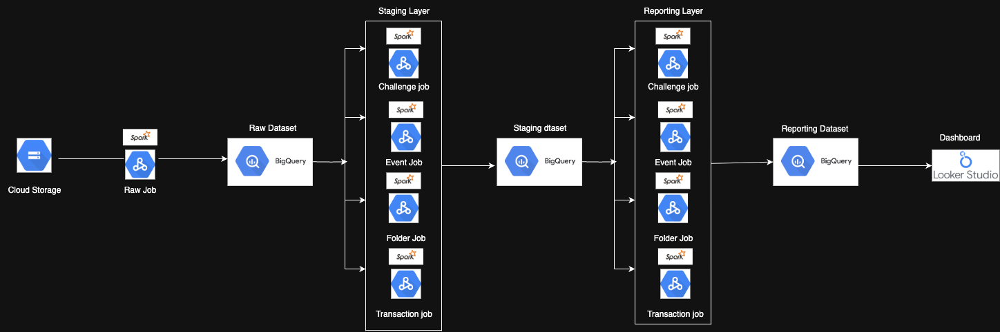

# 🛠️ GCP Data Pipeline 

This repository demonstrates a scalable and modular data pipeline architecture built on Google Cloud Platform for analytics and dashboarding use cases.

---

## 📌 Architecture Diagram

---

## 🔧 Components Used

| Layer              | Service              | Description                                                  |
|--------------------|----------------------|--------------------------------------------------------------|
| **Storage**        | Cloud Storage        | Stores raw data files                                        |
| **Transformation** | DataProc + Spark     | Distributed ETL for raw → staging → reporting               |
| **Data Warehouse** | BigQuery             | Stores raw, staging, and final reporting datasets            |
| **Visualization**  | Looker Studio        | Dashboarding tool consuming BigQuery reporting views        |

---

## 📁 Project Structure

Gcp_data_pipeline/
├── reporting_datasets_jobs/ # Spark jobs for final reporting layer
├── Staging_jobs/ # Spark jobs for intermediate staging layer
├── raw_data_insertion.py # Script for inserting raw data into BigQuery
├── GCp2.png # Architecture diagram image
└── README.md # Project documentation (this file)

---

## 💡 Notes

- BigQuery **views** were created to serve as the source for **Looker Studio dashboards**.
- `learnerobjectid` was used as a **proxy for user identity**, due to the absence of direct email mappings in the dataset.
- SQL scripts used for view creation are included in this repo and referenced in the GitHub README.

---

## 🔗 Author

- **LinkedIn**: [Nishank Majumdar](https://www.linkedin.com/in/nishank-majumdar/)
- **GitHub**: [@demonish11](https://github.com/demonish11?tab=repositories)

